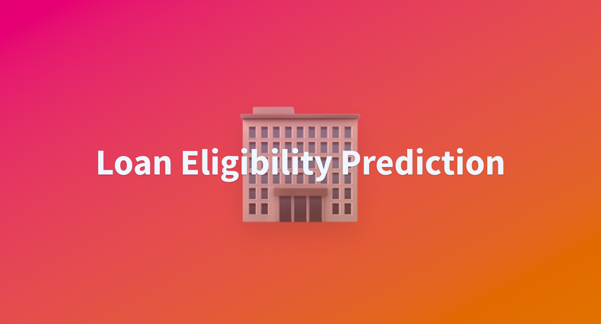

#h1 🏦 Loan Eligibility Prediction AI Model

🔗 🚀 Live Demo 
[Link Text](20scorepredictorbyzaidnaeem.streamlit.app)

> 📍 Project 5 of my **25 Premium AI Projects Challenge**

A machine learning model that predicts whether a loan should be approved or not — built with powerful exploratory data analysis, outlier handling, and model tuning on a small dataset of just 550 entries.

Despite limited data, advanced feature engineering and model optimization enabled performance rivaling large-scale systems — showcasing the power of clean preprocessing and impactful EDA.

---

## 🚀 Demo

🖥️ **Frontend**: Deployed using Streamlit  
🔍 **Try It Live**: *(Add link here once deployed)*

---

## 📌 Problem Statement

Given a dataset of loan applicants with attributes like income, education, dependents, credit history, etc., the goal is to:

> ✅ Predict whether the loan should be approved or not.

---

## 💡 Key Highlights

- 🔍 Performed deep EDA to expose unusual trends and outliers.
- 🏏 Outlier analysis inspired a fun "Outlier Premier League" concept during exploration.
- 🛠️ Crafted custom features using domain intuition (e.g., income-to-loan ratio, combined income).
- 📊 Compared models like SVM and XGBoost — with **XGBoost outperforming all**.
- 🌟 Final accuracy: **88.7%** on validation data.
- 💻 Built a clean and interactive UI using **Streamlit** for real-time predictions.

---

## 🧠 Tech Stack

| Area              | Tools & Libraries                         |
|-------------------|-------------------------------------------|
| Programming       | Python                                    |
| Data Analysis     | Pandas, NumPy                             |
| Visualization     | Seaborn, Matplotlib                       |
| ML Models         | Scikit-learn, XGBoost                     |
| Deployment        | Streamlit                                 |

---

## 📈 Use Case & Impact

This project demonstrates how even small datasets can be transformed into robust prediction systems using effective:

- 🔧 Data preprocessing
- 🔍 Feature engineering
- ⚙️ Model tuning

Ideal for:
- Loan officers to automate application filtering.
- EdTech demos to showcase ML pipelines.
- AI beginners to understand end-to-end workflows.
